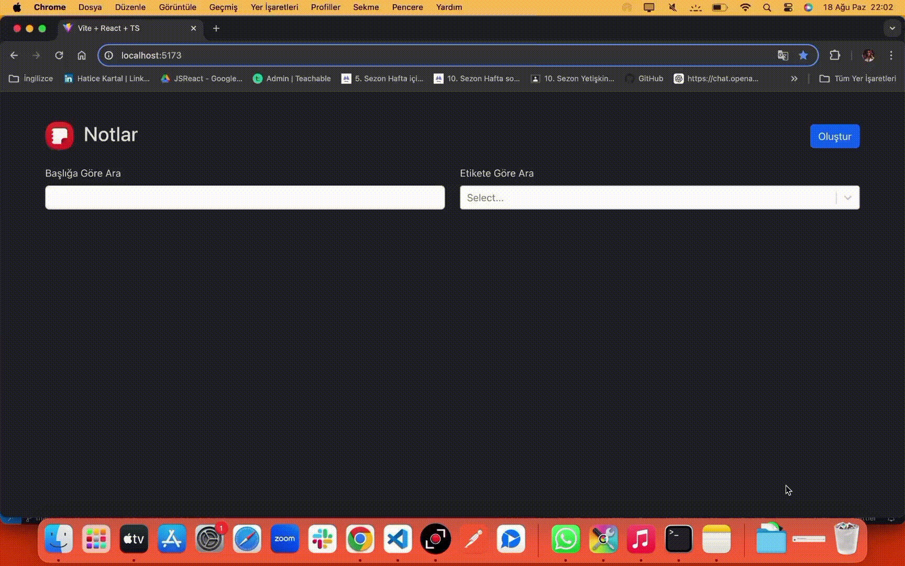

# Notes App
Bu proje, kullanıcıların notlarını kolayca oluşturup yönetebilecekleri basit bir notlar uygulamasıdır.

# Özellikler
- Not Ekleme: Kullanıcılar yeni notlar oluşturabilir ve kaydedebilir.
- Not Düzenleme: Kullanıcılar mevcut notları düzenleyebilir ve güncelleyebilir.
- Not Silme: Kullanıcılar istemedikleri notları silebilir.
- Notları Görüntüleme: Kullanıcılar kaydedilen tüm notları listeleyebilir ve tek tek görüntüleyebilir.

# Teknoloji ve Kütüphaneler

- TypeScript
- react-router-dom
- react-bootstrap
- bootstrap
- react-markdown
- react-select
- uuid

# GIF
